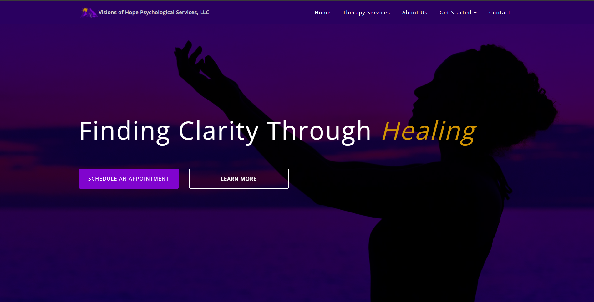
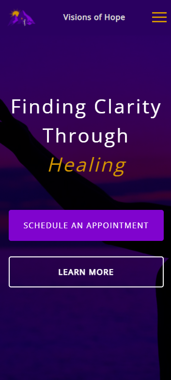

# VOHPS-LLC

##  Table of contents

- [Overview](#overview)
  - [Screenshot](#screenshot)
  - [Links](#links)
- [My process](#my-process)
  - [Built with](#built-with)
  - [What I learned](#what-i-learned)
  - [Continued development](#continued-development)
- [Author](#author)

## Overview

This is a multi-page freelance website that I built for Visions of Hope Psychological Services, LLC.  They are a local private practice based in Richmond, Virginia that needed to create their online presence as well as generate leads and provide current and potential clients with a space to learn more information about their private practice. 

### Screenshot

- Desktop Screenshot: 
- Mobile Screenshot: 

### Links

- Live site URL: [https://visionsofhope-va.com/](https://visionsofhope-va.com/)
- Github Repository URL: [https://github.com/artsycoder533/VOHPS-LLC.git](https://github.com/artsycoder533/VOHPS-LLC.git)

## My process

Before I started this project I searched the internet for mental health private practice website examples to see what kind of information was displayed on the site.  Once I explored a few pages I created a list of common feature I saw among all the websites.  Next, I looked at my clients Psychology Today page and made note of any information that I thought could be potentially added to the website.  I had quite a few things that I couldnt find the answer to on my own or could have potentially been outdated information.  I scheduled a facetime call with my client to go over the information I had found and to see if anything had changed, asked for clarification on their process, type of clients and services they offer, etc.  This is their first website for their business, so a lot of the details were still being figured out on their end.  Once I had a comprehensive list, I began organizing the information in terms of what page it should be listed on.  After that, I brainstomred the layout by drawing wireframes on blank paper to get a feel for where things should be on the page.  I begin to code and style the webpage section by section.  When I thought the information needed to be seperated, I added another webpage.  Once I get to a point where I felt like I was missing information that I thought should be listed I would contact the client for futher clarification.  I tried to put myself in the shoes of a potential client as to what answers I believed the website should provide to cut down on potential clients having to ask a lot of questions before they decided if they wanted to book an appointment.  

### Built With

- HTML5
- Sass
- JavaScript

### What I learned

I learned how to effictively communicate with a client and how to use the internet to find what type of information is typical for a private practice website.  While working on this project I learned how to implement interactive components in javascript such as an accordian, tabs, and a carousel.  Thinking about making a complete website for someone seemed daunting in the beginning, but once I broke it down into steps and made each step much more manageable.

### Continued Development

I will be performing on-going updates to this website at the clients request.

## Author

- Portfolio - [https://natashajohnson.dev/](https://natashajohnson.dev/)